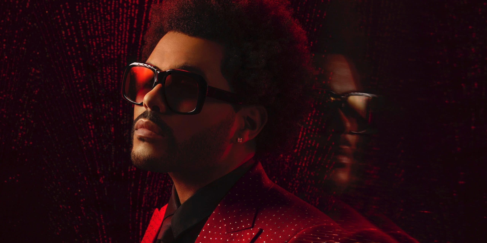

# Collaboration Project of China, Philippines & Nepal

___
### Loui Hernandez

Im from Manila Philippines! I love to read. I was a freelance graphic designer back from my country and decided to learn more so I decided to go to Canada and applied for Ineractive Media Design program. Aspiring to become a better Designer and be a Full stack developer.

___
### Jintao Duan

Hello,I'm Jintao Duan from China. I was a software tester, but now I want to be a web developer in Cannada in the future. On the other hand, I really like "The Weeknd" music and K-pop, So this is me.

___
### Suyog Ghimire

Hello, My name is Suyog Gimire. I am from Nepal. I am currently studying Interactive media design in Fanshawe College. My hobby is to listen to music, watch football and learn about history.

## Contributing
- Loui Hernandez
- Jintao Duan
- Suyog Ghimire

## License
MIT

WE need to learn and practice more.